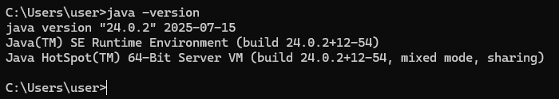

# Markdown 문법

## HTML에서 `<h1>~<h6>`


# 글자 크기
## 글자 크기
### 글자 크기
#### 글자 크기
##### 글자 크기
###### 글자 크기

### 문자 강조
*이탤릭체*  
**굵은 문자**

수평선
***

## 리스트
* 언오더드 리스트
* 언오더드 리스트
* 언오더드 리스트
    * 언오더드 리스트
    * 언오더드 리스트
        * 언오더드 리스트
        * 언오더드 리스트

1. 오더드리스트
2. 오더드리스트
3. 오더드리스트

# 코드블럭
``` java 
public class HelloWorld
{
	public static void main(String[] args) {
		System.out.println("Hello World!");
	}
}
```
인라인 코드는 `버튼`이나 코드 조작을 강조할 때 사용 vs code 에서 터미널을 열려면 `Ctrl` + `~`

# 링크

## 외부 링크
[구글접속](https://google.com "구글 주소")

## 내부 링크
[링크 라벨](#리스트)

# 그림삽입
